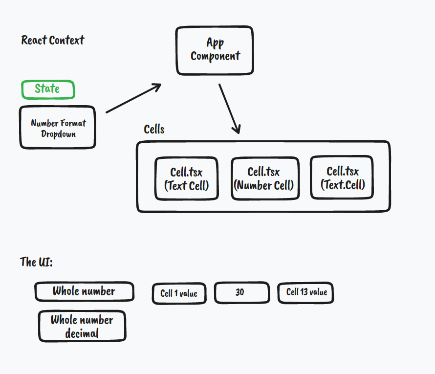
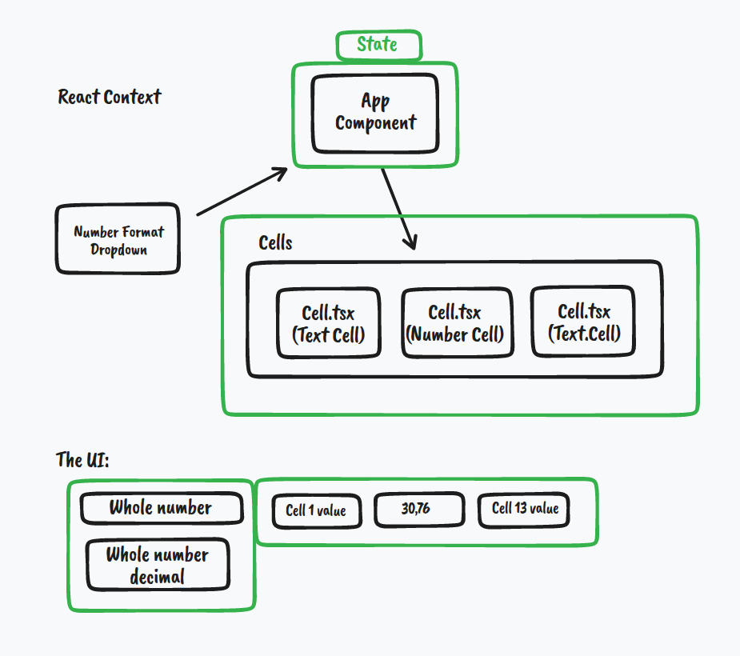
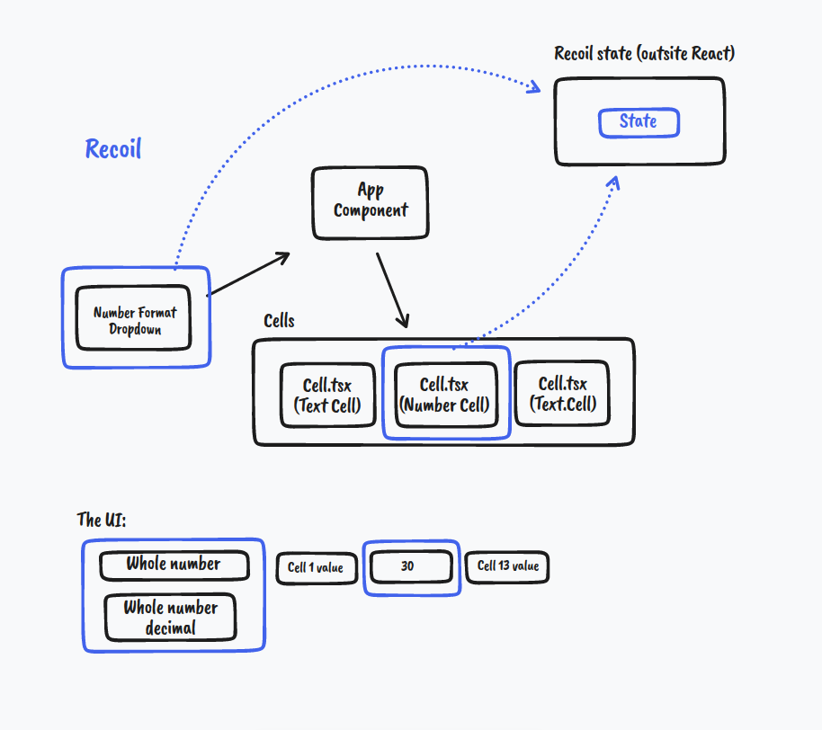

 

   
 

<h1 align="center">
    Learn Recoil
</h1>

 Introductory study on Recoil

🚧 WIP 🚧

**References:**
- [RecoilJS](https://recoiljs.org/)
- [learnrecoil](https://learnrecoil.com)
- [recoil-course](https://github.com/jacques-blom/recoil-course)

Overview & Setup

- **Why build Recoil?** Large number of rendered components that need to frequently update in isolation.
    
- **Recoil’s Key Features:**
    - **“Fexible shared state”**
        - Boilerplate-free
        - As simple as get/set
        - Allows for code-splitting
    - **“Derived data”**
        - Data can be devrived safety and simply from state and other derived data
        - Access derived data the same way you’d access state
        - Devirev data can be synchronous or asynchronous
    - **“App-wide state observation”**
        - Read any part Recoil state
        - Observe changes to state
        - Persist application state
        - Rehydration (backwards compatible)
- **Why use Recoil?** When your component tree and state structure don’t match.
    - **React Context**
        - Here we have a dropdown that has the number state, which is passed to the `App` component where it contains both text and number fields.

            

        - When you celebrate the option in the dropdown whole number decimal the number state changes to decimal causing the value of the field to change.

            
    - **Recoil**
        - The solution to this would be to use `recoil` and keep the states defined as a component outside of React.

            

    
Atoms

    
Selectors

    
Families

    
State Persistence

    
Suspense

    
Concurrent Mode

    
State Observation

    
Performance

    
Testing

    
Recoil Relay

    
How states are used in React without Recoil

